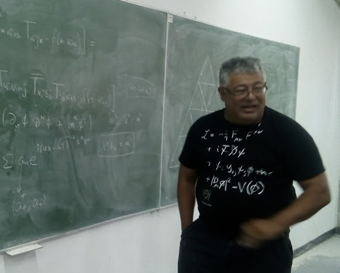

# UNIVERSITY PHYSICS

## Electromagnetism and Waves

  

## Description

This is the material I present in my **Houston Community College** calculus-based course on electromagnetism and waves.

Electromagnetic theory, as we understand it today, is a crowning achievement of 19th-century physics, with its foundation laid by the groundbreaking work of Michael Faraday and its completion by James Clerk Maxwell. Faraday, through a series of ingenious experiments, introduced the revolutionary concept of fields to explain electromagnetic phenomena, moving away from the idea of "action at a distance." He demonstrated that a changing magnetic field could induce an electric current—a principle known as electromagnetic induction, which is the basis for all electric generators and transformers. Building upon Faraday's experimental insights, Maxwell unified the separate laws of electricity and magnetism into a single, coherent mathematical framework. His set of four equations, now known as Maxwell's Equations, not only synthesized the work of Faraday and others but also made a stunning prediction: that changing electric and magnetic fields could propagate through space as a self-sustaining wave. This wave, which travels at the speed of light, proved that light itself is an electromagnetic phenomenon, thereby unifying optics with electricity and magnetism.

Maxwell’s prediction of light as an electromagnetic wave is a perfect example of the broader concept of waves. In a general sense, a wave is a disturbance or oscillation that travels through space and matter, transferring energy from one point to another without the permanent transfer of matter itself. Waves can be -almost- categorized into two main types: mechanical waves and electromagnetic waves. Mechanical waves, such as sound waves and water waves, require a physical medium to travel through and are caused by the vibration of particles within that medium. Electromagnetic waves, on the other hand, do not need a medium and can propagate through the vacuum of space. Both types of waves are characterized by fundamental properties like wavelength (the distance between two consecutive peaks), frequency (the number of oscillations per second), and amplitude (the maximum displacement from the equilibrium position), with their speed determined by the properties of the medium or vacuum they travel through. The number of wave categories was recently expanded to three with the announcement by the LIGO and Virgo collaborations on 11 February 2016, which reported the first direct observation of gravitational waves. These waves were detected on 14 September 2015, confirming what had previously only been inferred indirectly from their effects on pulsars in binary star systems. The detected waveform matched the predictions of general relativity for a gravitational wave produced by the merger of two black holes.

In this course, we will explore some of these fundamental ideas in detail, showing how they form the basis for much of our modern technology and shape our everyday lives.

## Bibliography

1. David Halliday, Robert Resnick, Jearl Walker. **Fundamentals of Physics**. Wiley, 2018. This is the official text for the course

2. Marcelo Alonso, Edward J. Finn. **Fundamental University Physics**, Volume 2. Addison-Wesley, 1983. A classic, this is an excellent book.

3. [**Electricity and Magnetism**. Berkeley Physics Course, Vol II.](https://en.wikipedia.org/wiki/Berkeley_Physics_Course)

4. [**Waves**. Berkeley Physics Course, Vol III.](https://en.wikipedia.org/wiki/Berkeley_Physics_Course)

5. A. P. Fench. **Vibrations and Waves**. CRC Press, 1971.

## Lectures

* [Module 1: Elementary Electrostatics: Coulomb's Law](Notes/Lect_01_Elementary_Electrostatics__Coulombs_Law.pdf)

* [Module 2: Electric Fields in Vacuum](Notes/Lect_02_Electric_Fields_In_Vacuum.pdf)

* [Module 3: Gauss's Law](Notes/Lect_03_Gauss_Law.pdf)

* [Module 4: Conductors and Insulators](Notes/Lect_04_Conductors_and_Insulators.pdf)

* [Module 5: Electrostatic Potential](Notes/Lect_05_Electrostatic_Potential.pdf)

* [Module 6: Capacitance](Notes/Lect_06_Capacitance.pdf)

* [Module 7: Electrostatic Energy](Notes/Lect_07_Electrostatic_Energy.pdf)

* [Module 8: Electric Current](Notes/Lect_08_Electric_Current.pdf)

* [Module 9: Electric Circuits I](Notes/Lect_09_Electric_Circuits_I.pdf)

* [Module 10: Magnetic Fields](Notes/Lect_10_Magnetic_Fields.pdf)

* [Module 11: Faraday Law of Induction](Notes/Lect_11_Faraday_Law.pdf)

* [Module 12: Inductance and Magnetic Energy](Notes/Lect_12_Inductance_and_Magnetic_Energy.pdf)

* [Module 13: Electric Circuits II](Notes/Lect_13_Oscillating_Circuits_and_Alternating_Currents.pdf)

* [Module 14: Maxwell's Equations](Notes/Lect_14_Maxwell_s_Equations.pdf)

* [Module 15: Introduction to Travelling Waves](Notes/Lect_15_Introduction_to_Travelling_Waves.pdf)

* [Module 16: Electromagnetic Waves and Energy. THe Poynting Vector](Notes/Lect_16_EM_Waves_and_Energy__Poynting_Vector.pdf)

